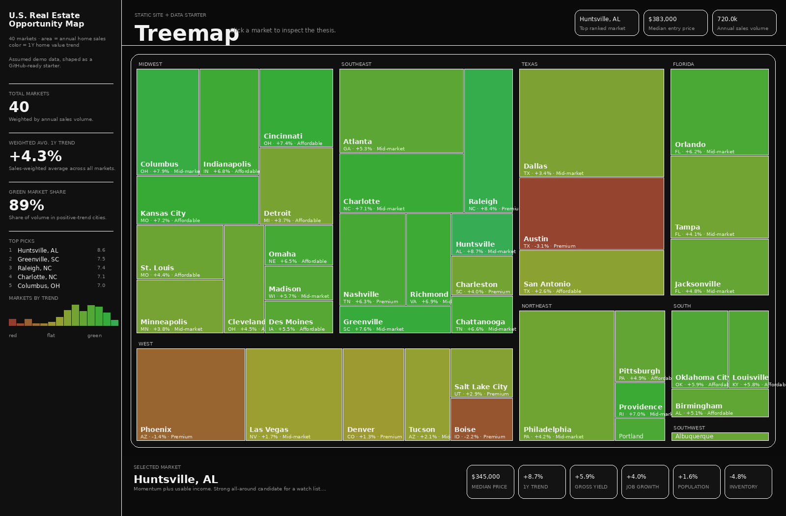
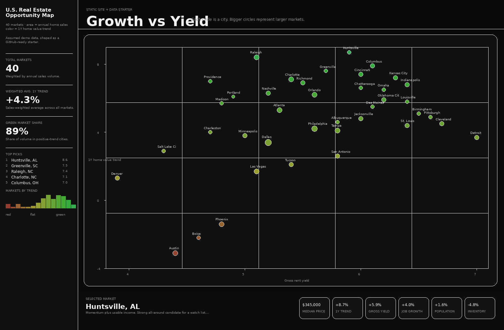

# U.S. Real Estate Opportunity Map

Interactive heatmap and analytics dashboard for exploring promising U.S. residential real estate markets using demo data for home value trend, rental yield, job growth, population growth, and inventory conditions.

Live demo: `https://bhushantomar.github.io/us-real-estate-opportunity-map/`



## Overview

This project visualizes 40 U.S. housing markets and ranks them across three investment lenses:

- **Balanced** — blends appreciation, yield, job growth, population growth, affordability, and supply tightness
- **Appreciation** — emphasizes recent home value trend, 5-year strength, and constrained inventory
- **Cash Flow** — favors stronger gross yield, lower entry price, and more negotiable supply

The site includes two interactive views:

- **Treemap** — rectangle area is proportional to annual home sales
- **Growth vs Yield** — bubble size represents market size, x-axis is gross yield, y-axis is 1Y home value trend

Color is intentionally independent from the scoring mode:

- **Green** = positive 1Y home value trend
- **Red** = negative 1Y home value trend

## Tech stack

- Python (standard library only)
- Static HTML, CSS, and JavaScript
- JSON dataset generated from a source file
- GitHub Pages for deployment

## Repository structure

| File | Purpose |
|---|---|
| `data/markets.json` | Source dataset with assumed market metrics |
| `site/index.html` | Local version of the interactive site |
| `site/data.json` | Computed frontend data for local preview |
| `docs/index.html` | GitHub Pages version of the site |
| `docs/data.json` | Computed frontend data for GitHub Pages |
| `assets/` | README screenshots |
| `build_site_data.py` | Rebuilds `site/data.json` and `docs/data.json` from source data |
| `standalone.html` | One-file demo version for quick sharing |
| `pyproject.toml` | Project metadata |

## How the data pipeline works

1. Edit or replace `data/markets.json`
2. Run `python build_site_data.py`
3. The script writes updated frontend data to:
   - `site/data.json`
   - `docs/data.json`
4. Commit those updated files to GitHub

## Local development

Rebuild data:

```bash
python build_site_data.py
```

Serve locally:

```bash
cd site
python -m http.server 8000
```

Then open `http://localhost:8000`.

## GitHub Pages deployment

This repo is set up to publish from the `docs/` directory.

1. Open your repository on GitHub
2. Go to **Settings** → **Pages**
3. Under **Build and deployment**, choose:
   - **Source:** Deploy from a branch
   - **Branch:** `main`
   - **Folder:** `/docs`
4. Save the settings
5. Wait for the site to deploy

Your site should be available at:

`https://bhushantomar.github.io/us-real-estate-opportunity-map/`

## Screenshots

### Treemap


### Growth vs Yield



## Updating the project

To refresh the rankings or swap in a better dataset:

1. Update `data/markets.json`
2. Run `python build_site_data.py`
3. Review the generated `site/data.json` and `docs/data.json`
4. Commit and push changes

## Notes

- All figures in this version are assumed demo values, not live market data
- This project is a visualization and ranking demo, not investment advice
- You can later replace the demo dataset with exports from Zillow, Redfin, Census, BLS, or your own pipeline

## License

MIT
